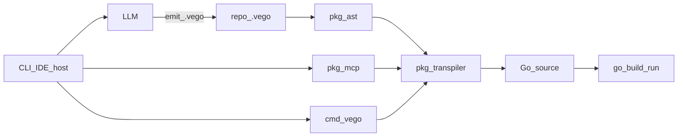
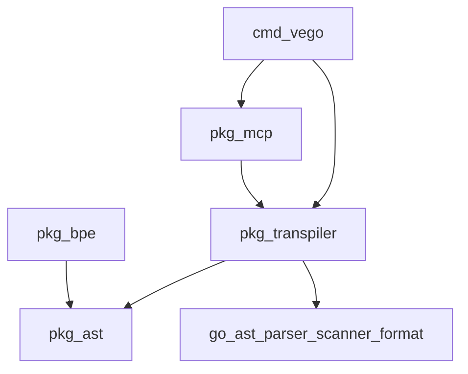
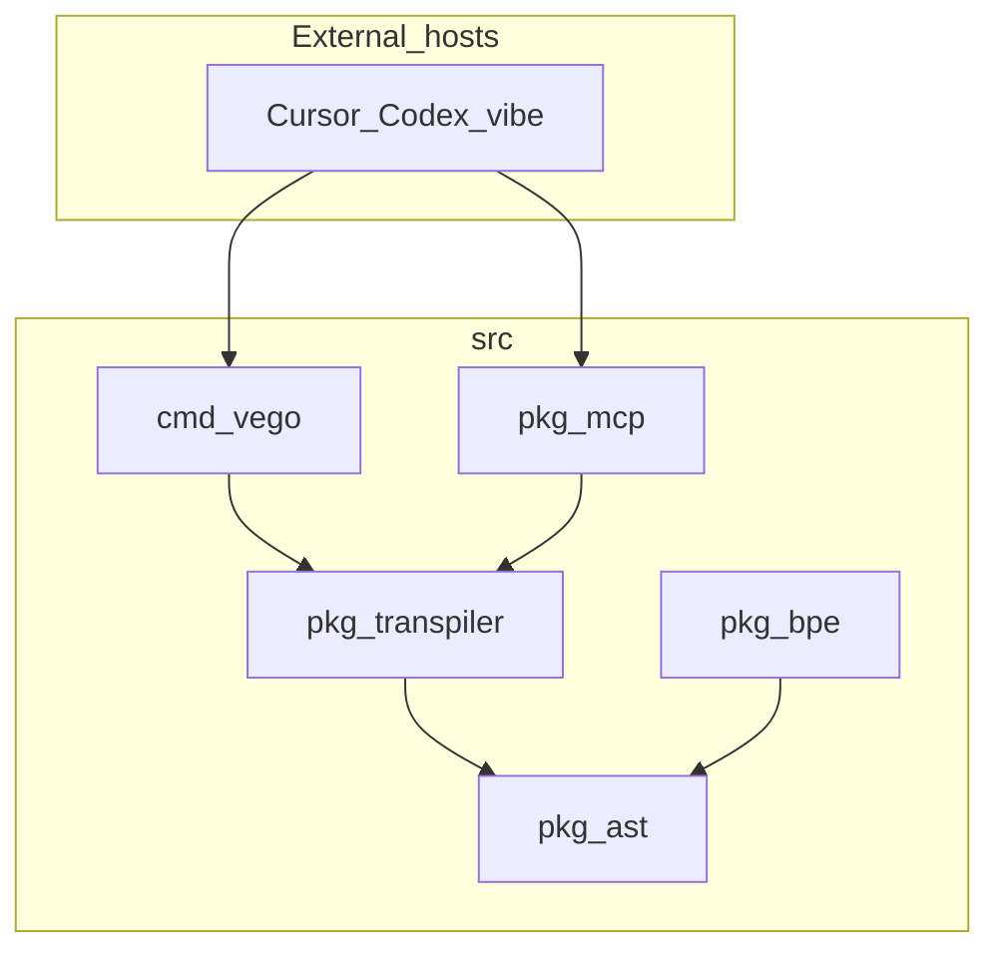

# Architecture Spine — VeGo

## Design Paradigm

**Pipes-and-filters source-to-source IR:** natural-language intent enters a CLI/IDE host; the LLM emits compact `.vego`; filters parse/transform to `go/ast`-equivalent Go; the standard Go toolchain executes. VeGo is never a VM, runtime, or `cmd/compile` fork.



## Invariants & Rules

### AD-1 — Transpile-only execution path [ADOPTED]

- **Binds:** all
- **Prevents:** treating VeGo as a runtime, VM, or fork of `cmd/compile`
- **Rule:** every executable path from `.vego` must produce Go acceptable to the standard `go` toolchain; no parallel compiler

### AD-2 — Bijective Go ↔ `.vego` transform [ADOPTED]

- **Binds:** `src/pkg/ast`, `src/pkg/transpiler`
- **Prevents:** lossy minify, one-way maps, silent semantic drift; dual semantic models
- **Rule:** `go/ast` (stdlib) is the sole semantic model for supported constructs; `.vego` is a versioned textual encoding of that model. For the supported grammar subset, round-trip must preserve `go/ast` semantic equivalence; alpha gates on fidelity, not token count. The Alpha grammar subset is locked in the product PRD (§4.1) and must not silently expand per package.

### AD-3 — LLM emission contract [ADOPTED]

- **Binds:** CLI/MCP/agent hosts, product source artifacts
- **Prevents:** Go-primary generation that bypasses the IR layer; divergent host writers
- **Rule:** agent-generated product source is `.vego`; Go is expansion-only (human audit, compiler input). Hosts (`cmd/vego`, `pkg/mcp`) must mutate the repo only through `pkg/transpiler` (+ `pkg/ast` maps); fail closed with no partial product files; expanded Go layout conventions are shared (not host-private).

### AD-4 — Package boundaries [ADOPTED]

- **Binds:** `src/` layout
- **Prevents:** MCP/CLI owning grammar or symbol maps; circular deps into methodology trees; dual alphabets
- **Rule:** `pkg/ast` = sole owner of keyword/phrase/import/lit/composite maps + CFG alphabet for on-disk `.vego`; `pkg/transpiler` = sole owner of Go↔`.vego` encode/decode over that alphabet (no second glyph table); `pkg/bpe` = measure-only (reads maps / counts tokens; never publishes a competing alphabet); `pkg/mcp` = protocol surface only; `cmd/vego` = CLI orchestration only; BMAD stays outside `src/`



### AD-5 — Alpha vs mid-term success [ADOPTED]

- **Binds:** MVP, TEA gates, planning metrics, `docs/OVERVIEW.md`, `docs/ADR.md` success framing
- **Prevents:** blocking alpha on ≥60% (or 60–85%) BPE reduction; treating research % claims as Alpha SLAs
- **Rule:** alpha ships when lossless compact IR + transpile + `go build`/`run` works; measured BPE % (historical 60–85% band) is a mid-term versioned hypothesis/benchmark, not an alpha acceptance gate

### AD-6 — Human bridge [ADOPTED]

- **Binds:** developer UX, review, git integration (when added)
- **Prevents:** humans authoring `.vego` as the primary editing mode
- **Rule:** human inspection and review use expand-to-Go (`vego fmt` / equivalent); optional git `textconv` is deferred tooling, not alpha-critical

### AD-7 — On-disk `.vego` text contract [ADOPTED]

- **Binds:** `src/pkg/ast`, `src/pkg/transpiler`, fixtures, agent emit
- **Prevents:** package-local wire formats, silent schema forks, dual printers/scanners
- **Rule:** one versioned on-disk `.vego` lexical/grammar contract; `pkg/ast` owns alphabet + maps; `pkg/transpiler` owns the scanner/printer that realize that contract ↔ Go. No third package may invent an alternate `.vego` dialect.

## Consistency Conventions

| Concern | Convention |
| --- | --- |
| Naming | Packages under `src/pkg/...`; module `github.com/sodawave/VeGO`; file ext `.vego` |
| Data & formats | `.vego` = product source; expanded `.go` = ephemeral or audit artifact unless explicitly checked in for bridge workflows |
| State & errors | Transform errors are explicit (parse/transform fail closed); never silently emit invalid Go |
| Methodology | Planning artifacts in `_bmad-output/`; durable knowledge in `docs/` |

## Stack

| Name | Version |
| --- | --- |
| Go | 1.27.0 (`go.mod`) |
| go/ast, go/parser, go/scanner, go/format, go/token | stdlib (brownfield transpile path) |
| pkoukk/tiktoken-go | v0.1.8 (measurement / mid-term metrics; not Alpha gate; direct `require`) |
| alecthomas/participle/v2 | deferred seed from ADR — hand-rolled scanner used today |
| spf13/cobra | deferred seed from ADR — `flag`-based `cmd/vego` today |
| mark3labs/mcp-go | deferred seed from ADR — minimal JSON-RPC stdio MCP today (re-pin on adopt) |

## Structural Seed

```text
src/
  cmd/vego/       # CLI orchestration
  pkg/ast/        # sole symbol maps + CFG alphabet
  pkg/transpiler/ # Go ↔ .vego (owns wire encode/decode)
  pkg/bpe/        # tiktoken measure-only
  pkg/mcp/        # MCP tool server (protocol only)
docs/             # OVERVIEW, ADR (knowledge; % demoted)
_bmad-output/     # spines, PRDs, forge
```



## Capability → Architecture Map

| Capability / Area | Lives in | Governed by |
| --- | --- | --- |
| Compact IR / grammar / maps | `src/pkg/ast` | AD-2, AD-4, AD-7 |
| Lossless transpile / wire encode | `src/pkg/transpiler` | AD-1, AD-2, AD-7 |
| Agent tool surface | `src/pkg/mcp`, `src/cmd/vego` | AD-3, AD-4, AD-6 |
| Alpha fidelity gates | TEA / tests + PRD §4.1 subset | AD-5 |
| Mid-term BPE metrics | `src/pkg/bpe` + tiktoken-go (measure; no Alpha SLA) | AD-5 |

## Deferred

- Full Go grammar coverage beyond alpha subset — wait until round-trip core exists
- Git `diff`/`textconv` driver — post-alpha human bridge polish
- LLM calibration dataset / system prompt for `.vego` emission — after CFG stabilizes
- Exact Unicode↔keyword dictionary validated per tokenizer — mid-term BPE goal
- Operational deploy topology for MCP hosting — not owned at this altitude yet
